# 定时任务报表系统 — 使用手册

> 版本：1.0.0 | 更新日期：2026-07-13

---

## 目录

1. [系统概述](#1-系统概述)
2. [登录系统](#2-登录系统)
3. [首页仪表盘](#3-首页仪表盘)
4. [SQL 管理](#4-sql-管理)
5. [网页爬取](#5-网页爬取)
6. [任务管理](#6-任务管理)
7. [任务日志](#7-任务日志)
8. [通知管理](#8-通知管理)
9. [数据源管理](#9-数据源管理)
10. [收件人管理](#10-收件人管理)
11. [报表模板](#11-报表模板)
12. [AI 助手](#12-ai-助手)
13. [存储配置](#13-存储配置)
14. [系统管理](#14-系统管理)

---

## 1. 系统概述

**定时任务报表系统**是一个企业级的自动化报表生成与分发平台，支持以下核心功能：

| 功能模块 | 说明 |
|---------|------|
| **SQL 任务** | 多数据源 SQL 查询，输出 CSV / Excel / Word / PPT / TXT 等格式 |
| **网页爬取** | 静态页面（Jsoup）和动态页面（Selenium）数据采集 |
| **任务调度** | 基于 Quartz 的 CRON 定时调度和一次性任务 |
| **报表模板** | Excel / Word / PPT 模板，通过 `${fieldName}` 占位符自动填充 |
| **图表生成** | 支持柱状图、折线图、饼图、面积图、散点图等 |
| **通知分发** | 邮件、企业微信、钉钉、飞书、Slack、Webhook |
| **AI 助手** | 自然语言生成 SQL、智能通知优化、数据分析对话 |
| **存储管理** | 本地存储、阿里云 OSS、AWS S3、WebDAV |
| **权限控制** | 基于角色的访问控制（RBAC），支持用户/角色/权限管理 |

### 技术栈

- **后端**：Java 17 + Spring Boot 3 + MyBatis-Plus + Quartz
- **前端**：Vue 3 + TypeScript + Element Plus + Vite
- **数据库**：MySQL 8.0

---

## 2. 登录系统

打开浏览器访问系统地址，进入登录页面。


**操作说明：**

1. 在 **用户名** 输入框中输入您的账号
2. 在 **密码** 输入框中输入密码
3. 点击 **登录** 按钮，或按回车键快速登录
4. 登录成功后自动跳转到首页仪表盘

> **默认账号**：系统初始化时自动创建管理员账号 `admin`

---

## 3. 首页仪表盘

登录后进入首页仪表盘，展示系统整体运行状况。

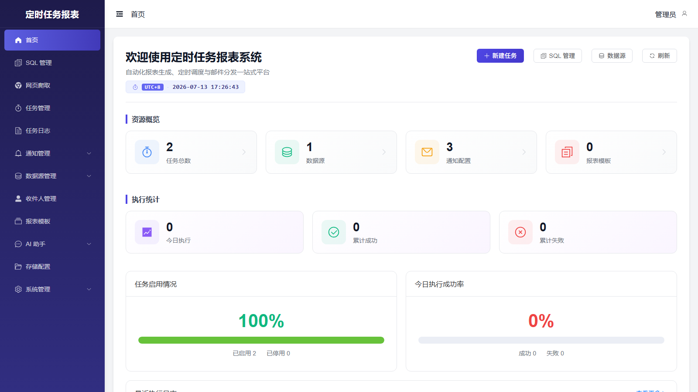

### 功能区域

| 区域 | 说明 |
|------|------|
| **资源概览** | 展示任务总数、数据源数量、通知配置数、报表模板数 |
| **执行统计** | 展示今日执行次数、累计成功次数、累计失败次数 |
| **任务启用情况** | 以进度条展示已启用/已停用的任务比例 |
| **今日执行成功率** | 展示当日任务执行的成功/失败比例 |
| **快捷入口** | 右上角提供"新建任务"、"SQL 管理"、"数据源"快捷按钮 |
| **服务器时间** | 显示当前服务器时间（UTC+8 时区） |

### 常用操作

- 点击 **新建任务** 按钮快速创建定时任务
- 点击 **SQL 管理** 按钮跳转到 SQL 配置页面
- 点击 **数据源** 按钮跳转到数据源管理页面
- 点击 **刷新** 按钮重新加载仪表盘数据

---

## 4. SQL 管理

SQL 管理模块用于配置数据查询语句，是报表生成的核心。

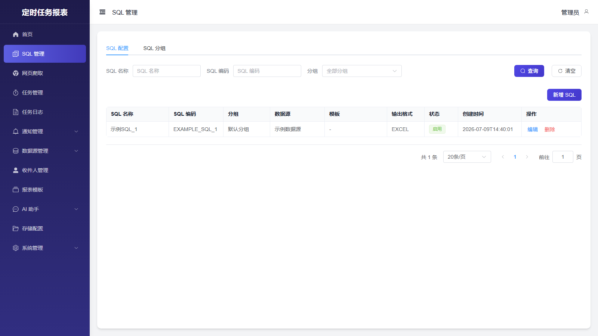

### 4.1 列表页面

- **SQL 配置** Tab：展示所有 SQL 配置项
- **SQL 分组** Tab：管理 SQL 的分组分类
- 支持按 SQL 名称、SQL 编码、分组进行搜索过滤
- 表格展示 SQL 名称、编码、分组、数据源、模板、输出格式、状态等信息
- 操作列支持 **编辑** 和 **删除**

### 4.2 新建/编辑 SQL

点击 **新增 SQL** 按钮或列表中的 **编辑** 链接，打开 SQL 配置对话框。

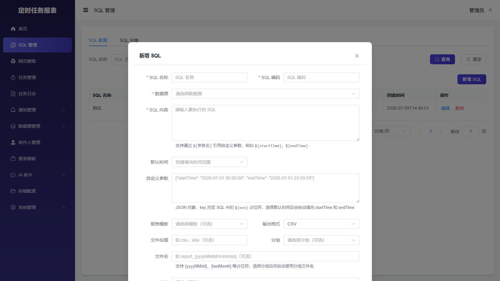

**配置项说明：**

| 字段 | 说明 |
|------|------|
| **SQL 名称** | SQL 配置的显示名称（必填） |
| **SQL 编码** | 唯一标识编码，用于程序引用（必填） |
| **数据源** | 选择该 SQL 要查询的数据库（必填） |
| **SQL 内容** | 查询语句，支持 `${参数名}` 占位符引用自定义参数（必填） |
| **默认时间** | 快捷填充时间范围（如：今天、昨天、本周、本月等） |
| **自定义参数** | JSON 格式，key 对应 SQL 中的 `${xxx}` 占位符 |
| **报表模板** | 关联 Excel/PPT/Word 模板文件，用于格式化输出 |
| **输出格式** | 支持 CSV、Excel、Word、PPT、TXT、INLINE |
| **Excel 合并组** | 同组的多个 SQL 合并到同一 Excel 文件的不同 Sheet |
| **Sheet 名称** | 自定义 Sheet 名称，默认使用 SQL 名称 |

**高级特性：**

- SQL 结果包含 `_sheet_name` 列时，系统自动按该列值分 Sheet 生成 Excel
- 支持 `${startTime}`、`${endTime}` 等时间参数，可通过默认时间快捷填充
- 参数值使用 JSON 对象格式，例如：`{"startTime": "2026-07-01 00:00:00", "endTime": "2026-07-01 23:59:59"}`

### 4.3 SQL 分组

切换到 **SQL 分组** Tab，可以创建和管理 SQL 分组，便于对大量 SQL 进行分类管理。分组在任务配置时可用于快速筛选 SQL。

---

## 5. 网页爬取

网页爬取模块支持从 Web 页面采集数据并生成报表。

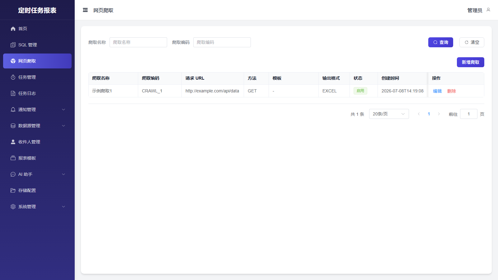

### 5.1 列表页面

- 支持按爬取名称、爬取编码搜索
- 表格展示爬取名称、编码、请求 URL、方法、模板、输出格式、状态等信息
- 操作列支持 **编辑** 和 **删除**

### 5.2 新建/编辑爬取配置

点击 **新增爬取** 按钮或列表中的 **编辑** 链接，打开爬取配置对话框。对话框采用多 Tab 页设计。

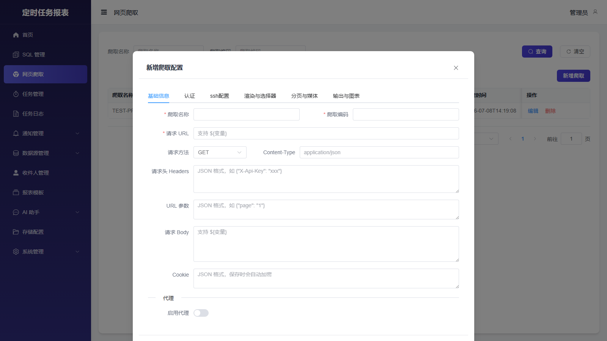

**Tab 页说明：**

| Tab | 配置内容 |
|-----|---------|
| **基础信息** | 爬取名称、编码、请求 URL、请求方法、Content-Type、请求头、URL 参数、请求 Body、Cookie |
| **认证** | HTTP Basic 认证、Bearer Token 等认证方式配置 |
| **SSH 配置** | SSH 隧道配置，支持跳板机访问内网资源 |
| **渲染与选择器** | 页面渲染方式（静态/动态）、CSS/XPath/正则选择器配置 |
| **分页与媒体** | 分页爬取配置、媒体文件下载设置 |
| **输出与图表** | 输出格式、图表类型、图表样式配置 |

**关键配置说明：**

- **请求 URL**：要爬取的目标页面地址（必填）
- **请求方法**：GET / POST
- **请求头 Headers**：JSON 格式，如 `{"X-Api-Key": "xxx"}`
- **URL 参数**：JSON 格式，如 `{"page": "1"}`
- **请求 Body**：支持 `${变量}` 占位符
- **Cookie**：JSON 格式，保存时自动加密
- **代理**：支持 HTTP 代理配置

---

## 6. 任务管理

任务管理模块用于创建和管理定时调度任务。

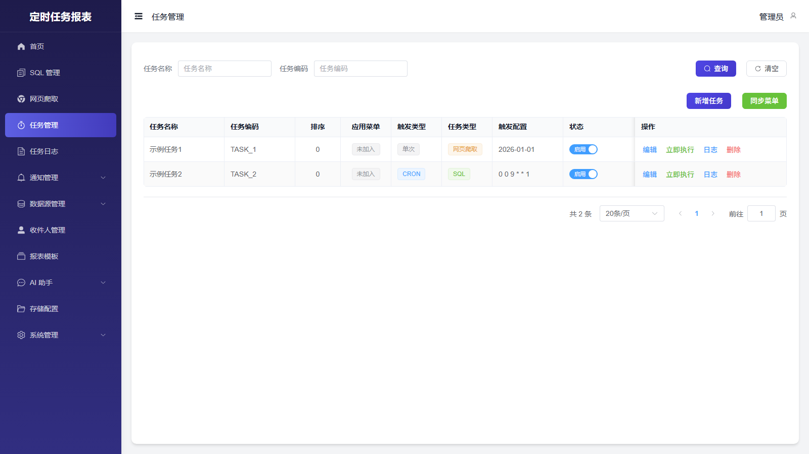

### 6.1 列表页面

- 支持按任务名称、任务编码搜索
- 表格展示任务名称、编码、排序、应用菜单、触发类型、任务类型、触发配置、状态等信息
- 操作列支持 **编辑**、**立即执行**、**日志**、**删除**
- **同步菜单** 按钮用于将任务同步到企业微信应用菜单

### 6.2 新建任务

点击 **新增任务** 按钮，打开任务配置对话框。

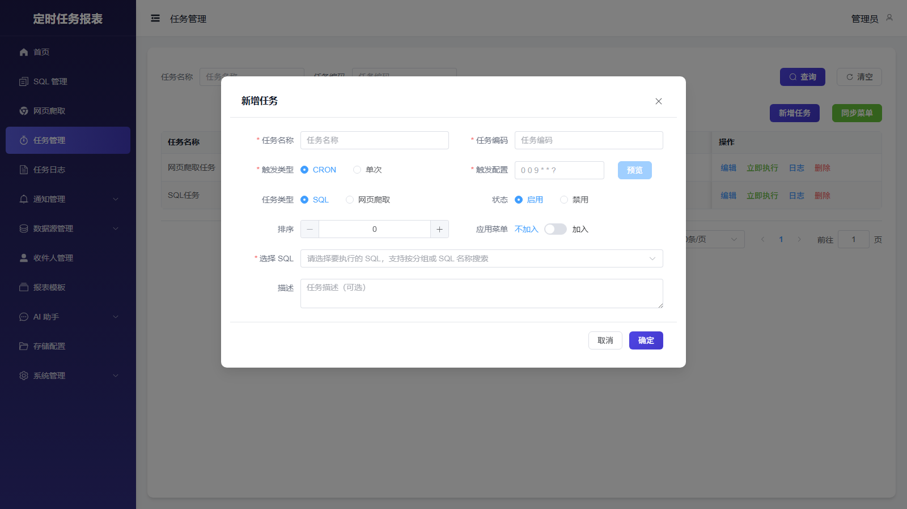

**配置项说明：**

| 字段 | 说明 |
|------|------|
| **任务名称** | 任务的显示名称（必填） |
| **任务编码** | 唯一标识编码（必填） |
| **触发类型** | CRON（定时触发）或 单次（执行一次） |
| **触发配置** | CRON 表达式，如 `0 0 9 * * ?` 表示每天 9:00 执行 |
| **任务类型** | SQL（执行 SQL 查询）或 网页爬取 |
| **状态** | 启用 / 禁用 |
| **排序** | 任务排序值，数字越小越靠前 |
| **应用菜单** | 是否加入企业微信应用菜单 |
| **选择 SQL** | 选择该任务要执行的 SQL（支持按分组或名称搜索） |
| **描述** | 任务描述（可选） |

**CRON 表达式预览：** 输入 CRON 表达式后，点击 **预览** 按钮可查看接下来 5 次的执行时间。

### 6.3 任务操作

| 操作 | 说明 |
|------|------|
| **立即执行** | 手动触发任务执行，不影响定时调度 |
| **日志** | 查看该任务的执行历史记录 |
| **启用/禁用** | 切换任务状态，禁用后定时调度不再触发 |
| **删除** | 删除任务（不可恢复） |

---

## 7. 任务日志

任务日志模块记录所有任务的执行历史。

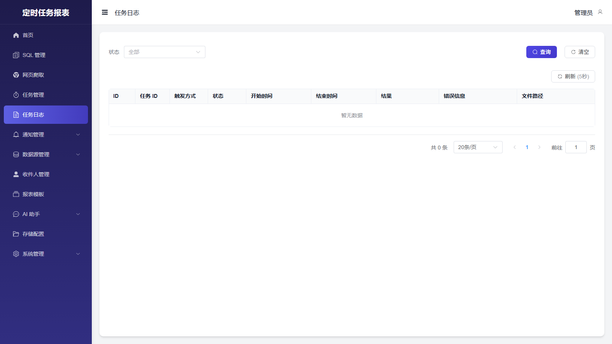

### 功能说明

- **状态筛选**：支持按"全部"、"成功"、"失败"筛选日志
- **自动刷新**：点击 **刷新(5秒)** 按钮开启自动刷新，每 5 秒自动更新日志列表
- 表格展示 ID、任务 ID、触发方式（手动/定时）、状态（成功/失败）、开始时间、结束时间、结果、错误信息、文件路径等信息

### 日志信息解读

| 字段 | 说明 |
|------|------|
| **触发方式** | 手动（用户点击立即执行）或 定时（CRON 自动触发） |
| **状态** | 绿色"成功"或红色"失败"标签 |
| **结果** | 执行结果的简要描述，如"生成 1 个报表文件" |
| **错误信息** | 失败时展示具体的错误原因 |
| **文件路径** | 生成的报表文件存储路径 |

---

## 8. 通知管理

通知管理模块包含**通知规则**和**通知配置**两个子模块。

### 8.1 通知配置

通知配置用于管理各种通知渠道的连接参数。

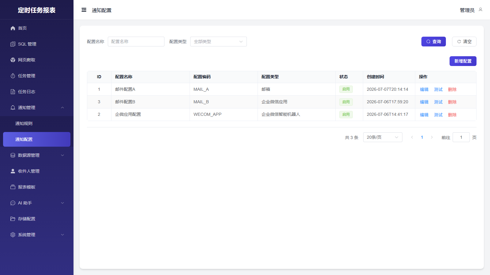

**支持的配置类型：**

| 类型 | 说明 |
|------|------|
| **邮箱** | SMTP 邮件服务配置 |
| **企业微信应用** | 企业微信应用消息推送 |
| **企业微信群机器人** | 企业微信群机器人 Webhook |
| **企业微信智能机器人** | 企业微信智能机器人长连接 |
| **钉钉** | 钉钉机器人 Webhook |
| **飞书** | 飞书机器人 Webhook |
| **Slack** | Slack Webhook |
| **自定义 Webhook** | 通用 HTTP 回调 |

**邮箱配置示例：**

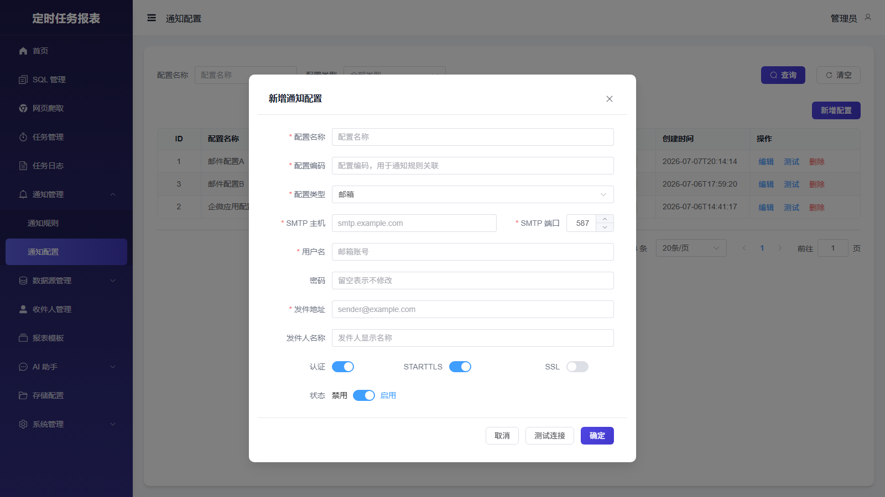

| 字段 | 说明 |
|------|------|
| **配置名称** | 配置的显示名称（必填） |
| **配置编码** | 唯一标识编码（必填） |
| **配置类型** | 选择通知渠道类型（必填） |
| **SMTP 主机** | 邮件服务器地址，如 `smtp.exmail.qq.com` |
| **SMTP 端口** | 邮件服务器端口，如 `587`（STARTTLS）或 `465`（SSL） |
| **用户名** | 邮箱账号 |
| **密码** | 邮箱密码或授权码（加密存储） |
| **发件地址** | 发件人邮箱地址 |
| **发件人名称** | 发件人显示名称 |
| **认证** | 是否启用 SMTP 认证 |
| **STARTTLS** | 是否启用 STARTTLS 加密 |
| **SSL** | 是否启用 SSL 加密 |
| **状态** | 启用 / 禁用 |

**测试连接：** 配置完成后点击 **测试连接** 按钮验证配置是否正确。

### 8.2 通知规则

通知规则定义了什么事件触发什么通知。

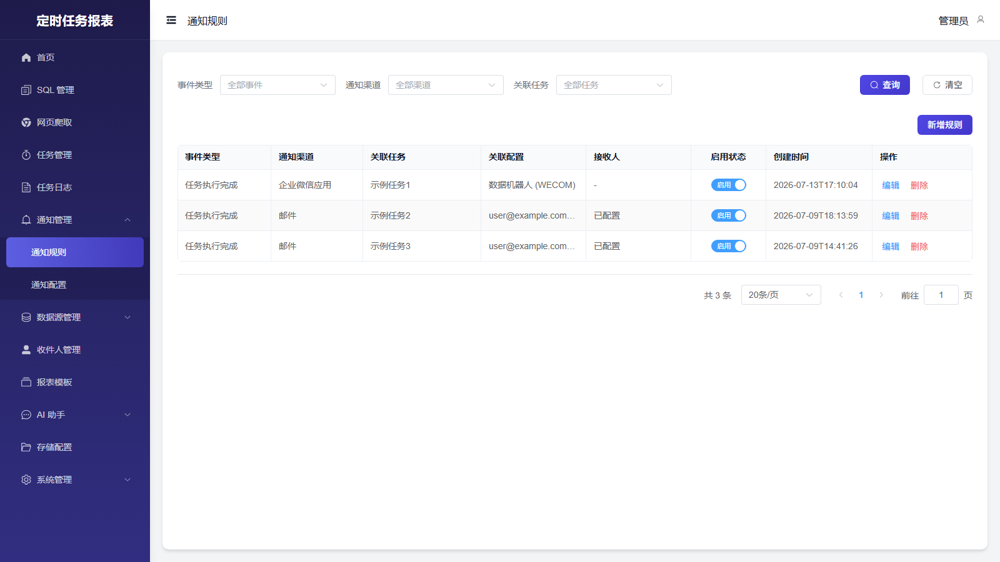

**列表功能：**
- 支持按事件类型、通知渠道、关联任务筛选
- 表格展示事件类型、通知渠道、关联任务、关联配置、接收人、启用状态等信息

**新建/编辑通知规则：**

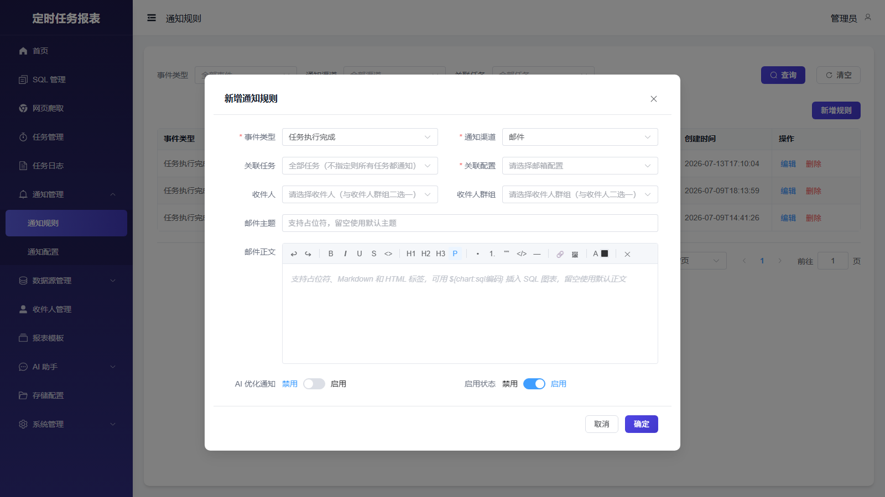

| 字段 | 说明 |
|------|------|
| **事件类型** | 触发通知的事件，如"任务执行完成"、"任务执行失败" |
| **通知渠道** | 发送通知的渠道类型 |
| **关联任务** | 选择触发通知的任务 |
| **关联配置** | 选择通知渠道对应的配置 |
| **收件人** | 选择接收通知的收件人（与收件人群组二选一） |
| **收件人群组** | 选择接收通知的收件人群组 |
| **邮件主题** | 通知邮件的标题 |
| **邮件正文** | 通知邮件的正文内容（支持富文本编辑） |
| **AI 优化通知** | 启用后，AI 自动优化通知内容的措辞和格式 |
| **启用状态** | 启用 / 禁用 |

---

## 9. 数据源管理

数据源管理模块包含**数据源**、**同步日志**和**自定义 prompt** 三个子模块。

### 9.1 数据源

数据源是 SQL 查询的数据库连接配置。

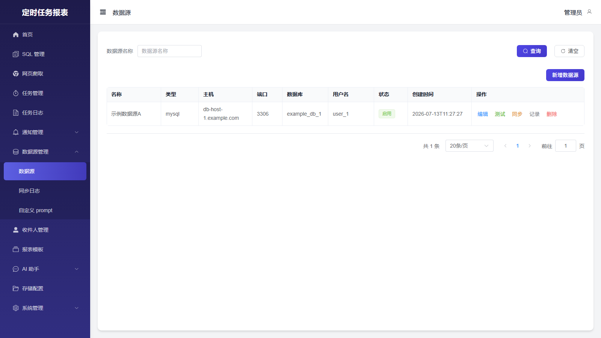

**列表功能：**
- 支持按数据源名称搜索
- 表格展示名称、类型、主机、端口、数据库、用户名、状态等信息
- 操作列支持 **编辑**、**测试**、**同步**、**记录**、**删除**

**新建/编辑数据源：**

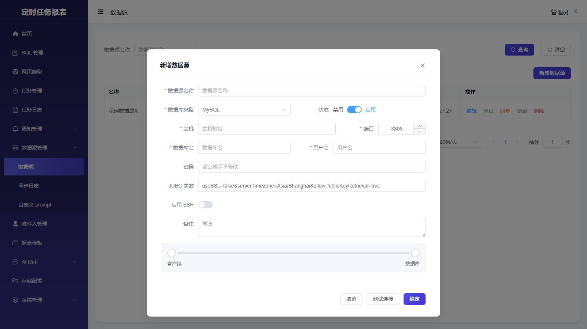

| 字段 | 说明 |
|------|------|
| **数据源名称** | 数据源的显示名称（必填） |
| **数据库类型** | MySQL（必填） |
| **状态** | 启用 / 禁用 |
| **主机** | 数据库服务器地址（必填） |
| **端口** | 数据库端口号，MySQL 默认 3306（必填） |
| **数据库名** | 目标数据库名称（必填） |
| **用户名** | 数据库用户名（必填） |
| **密码** | 数据库密码（加密存储） |
| **JDBC 参数** | 额外 JDBC 连接参数，如 `useSSL=false&serverTimezone=Asia/Shanghai` |

**SSH 隧道配置（高级）：**

| 字段 | 说明 |
|------|------|
| **启用 SSH** | 开关，启用后通过 SSH 隧道连接数据库 |
| **SSH 主机** | SSH 跳板机地址 |
| **SSH 端口** | SSH 端口号，默认 22 |
| **SSH 用户名** | SSH 登录用户名 |
| **认证方式** | 密码认证或私钥认证 |
| **SSH 私钥** | OpenSSH 格式的私钥内容 |
| **私钥密码** | 私钥的保护密码（可选） |

**操作说明：**
- **测试**：验证数据源连接是否正常
- **同步**：同步数据库表结构，生成数据字典文档（供 AI 使用）
- **记录**：查看该数据源的同步历史记录

### 9.2 同步日志

记录数据源表结构同步的历史。

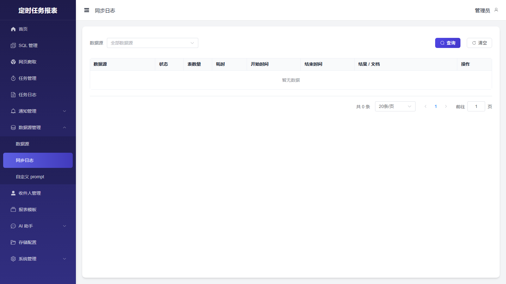

- 支持按数据源筛选
- 表格展示数据源、状态、表数量、耗时、开始时间、结束时间、结果/文档等信息
- 点击 **查看文档** 可以查看该次同步生成的数据字典文档

### 9.3 自定义 prompt

为每个数据源配置自定义的 AI prompt，用于提升 AI 生成 SQL 的准确性。

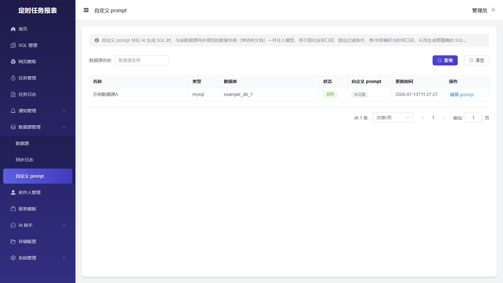

**作用说明：** 自定义 prompt 会在 AI 生成 SQL 时，与该数据源同步得到的数据字典（表结构文档）一并注入模型，用于固化业务口径、固定过滤条件、表/字段偏好与时间口径，从而生成更精确的 SQL。

- 列表展示所有数据源及其 prompt 配置状态
- 点击 **编辑 prompt** 为指定数据源配置自定义 prompt

---

## 10. 收件人管理

收件人管理模块用于维护邮件通知的接收人信息。

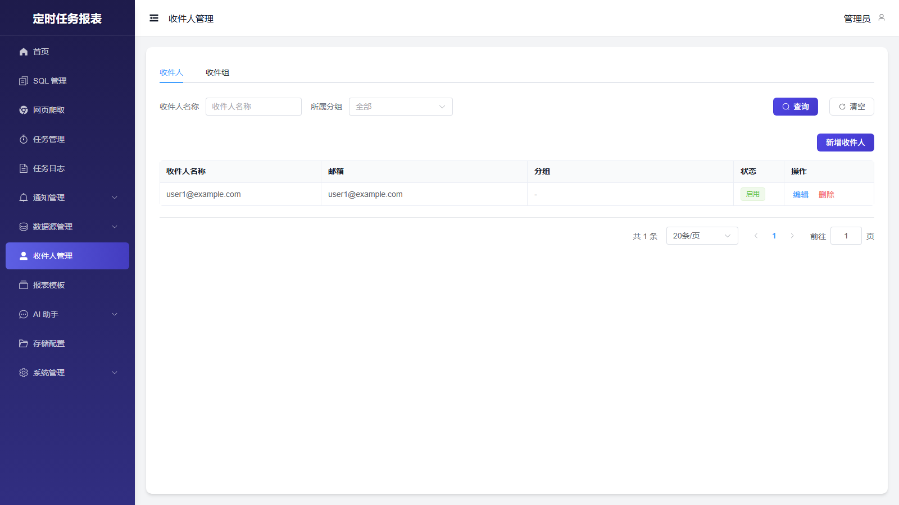

### 功能说明

- **收件人** Tab：管理单个收件人
  - 支持按收件人名称、所属分组搜索
  - 表格展示收件人名称、邮箱、分组、状态等信息
  - 操作列支持 **编辑** 和 **删除**
- **收件组** Tab：管理收件人群组
  - 将多个收件人分组管理，方便批量配置通知规则

**新建收件人：** 点击 **新增收件人** 按钮，填写收件人名称、邮箱地址和所属分组即可。

---

## 11. 报表模板

报表模板模块用于上传和管理 Excel / PPT / Word 模板文件。

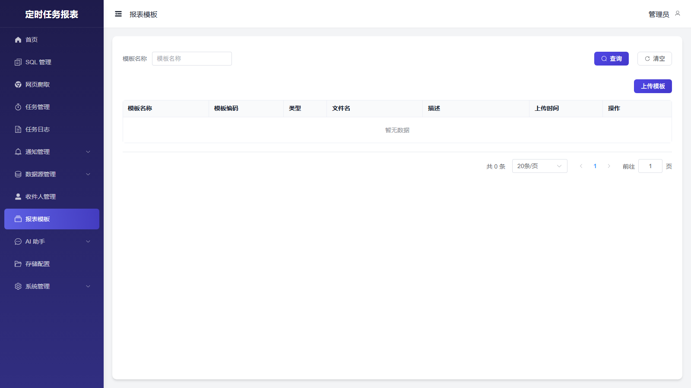

### 功能说明

- 支持按模板名称搜索
- 表格展示模板名称、模板编码、类型（EXCEL/PPT/WORD）、文件名、描述、上传时间等信息
- 操作列支持 **编辑** 和 **删除**

### 模板使用说明

**模板格式：** 模板文件中使用 `${fieldName}` 作为占位符，系统在执行 SQL 查询后自动将查询结果填充到对应的占位符位置。

**支持的模板类型：**

| 类型 | 文件格式 | 说明 |
|------|---------|------|
| **Excel** | `.xlsx` | 单元格级别的数据填充，支持多 Sheet |
| **PPT** | `.pptx` | 幻灯片中的文本和图表占位符填充 |
| **Word** | `.docx` | 文档中的文本占位符填充 |
| **CSV** | `.csv` | 直接输出 CSV 格式数据 |
| **TXT** | `.txt` | 纯文本格式输出 |

**上传模板：** 点击 **上传模板** 按钮，选择本地模板文件并填写模板名称和编码。

---

## 12. AI 助手

AI 助手模块提供自然语言交互式的数据分析能力。

### 12.1 AI 对话

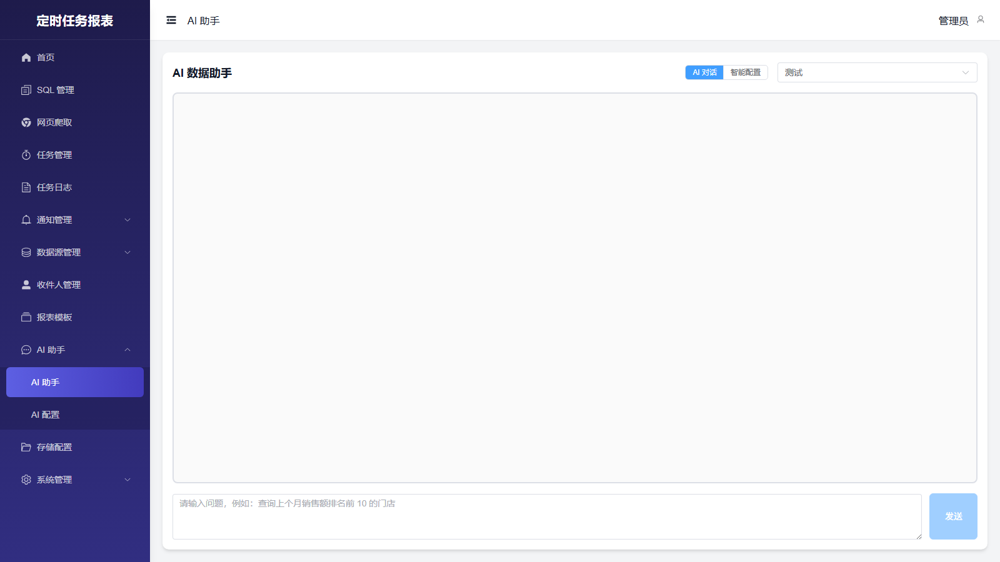

**功能说明：**

- **AI 对话** 模式：与 AI 进行自然语言对话，AI 可以理解业务问题并自动生成 SQL 查询
- **智能配置** 模式：切换不同的 AI 模型配置
- 在下方输入框中输入问题，如"查询上个月销售额排名前 10 的门店"
- AI 会自动分析数据源结构，生成对应的 SQL 并返回查询结果

**使用场景：**

| 场景 | 示例 |
|------|------|
| **数据查询** | "查询上周各城市的订单量" |
| **数据分析** | "分析一下最近 3 个月用户增长趋势" |
| **报表生成** | "生成一份本月销售汇总报表" |
| **图表生成** | "用柱状图展示各地区收入对比" |

### 12.2 AI 配置

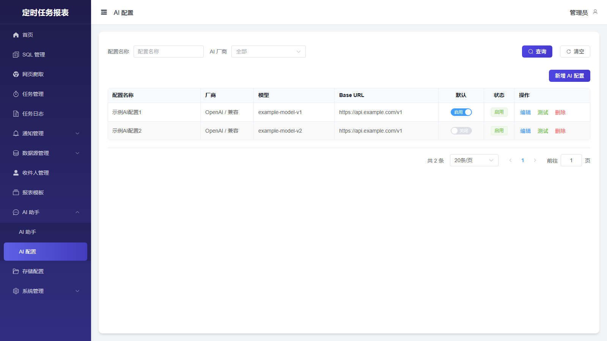

**功能说明：**

- 支持按配置名称、AI 厂商搜索
- 表格展示配置名称、厂商、模型、Base URL、默认状态等信息
- 操作列支持 **编辑**、**测试**、**删除**

**配置项说明：**

| 字段 | 说明 |
|------|------|
| **配置名称** | AI 配置的显示名称 |
| **厂商** | AI 服务提供商（OpenAI / 兼容 等） |
| **模型** | 使用的 AI 模型名称 |
| **Base URL** | API 服务地址 |
| **API Key** | 访问密钥（加密存储） |
| **默认** | 是否为默认使用的 AI 配置 |

---

## 13. 存储配置

存储配置模块管理报表文件的存储后端。

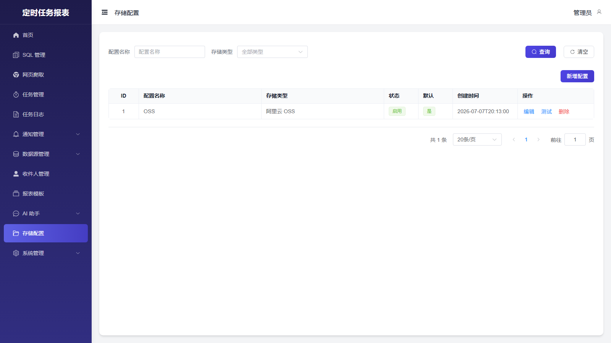

### 支持的存储类型

| 类型 | 说明 |
|------|------|
| **本地存储** | 文件存储在服务器本地磁盘 |
| **阿里云 OSS** | 阿里云对象存储服务 |
| **AWS S3** | 亚马逊云对象存储服务 |
| **WebDAV** | 基于 WebDAV 协议的网络存储 |

### 功能说明

- 支持按配置名称、存储类型搜索
- 表格展示配置名称、存储类型、状态、是否为默认等信息
- 操作列支持 **编辑**、**测试**、**删除**
- 标记为 **默认** 的存储配置将作为新任务的默认存储位置

---

## 14. 系统管理

系统管理模块包含**用户管理**和**角色管理**两个子模块。

### 14.1 用户管理

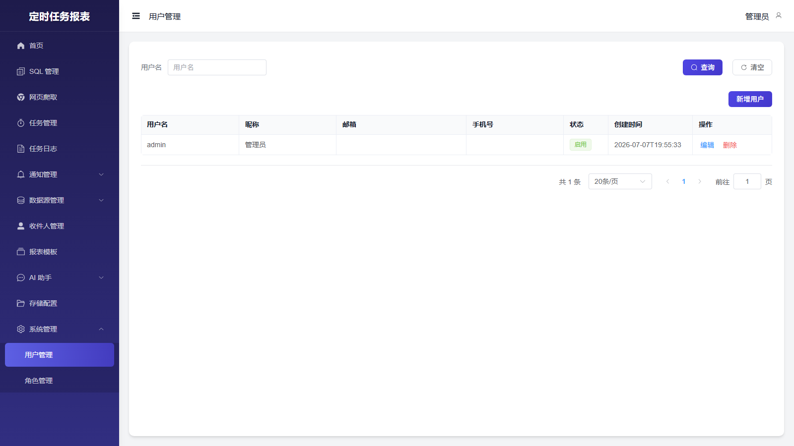

**功能说明：**

- 支持按用户名搜索
- 表格展示用户名、昵称、邮箱、手机号、状态、创建时间等信息
- 操作列支持 **编辑** 和 **删除**

**新建用户：** 点击 **新增用户** 按钮，填写用户名、密码、昵称、邮箱等信息，并分配角色。

**编辑用户：** 可以修改用户的基本信息、重置密码、分配角色、启用/禁用账号。

### 14.2 角色管理

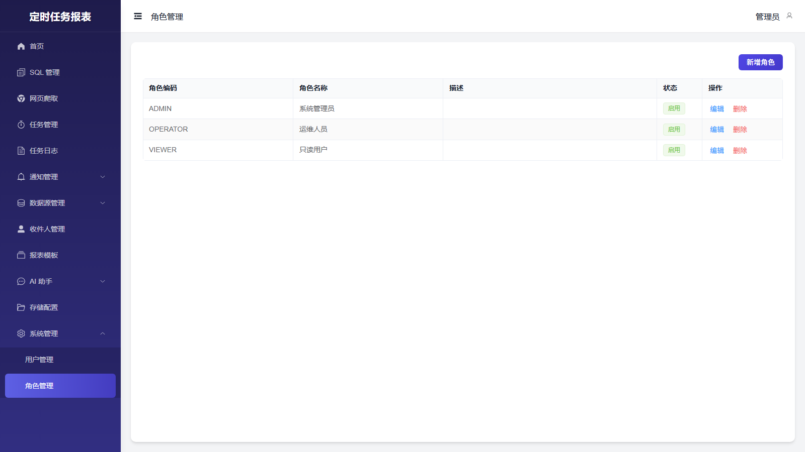

**内置角色：**

| 角色编码 | 角色名称 | 说明 |
|---------|---------|------|
| **ADMIN** | 系统管理员 | 拥有所有权限，可管理系统的所有功能 |
| **OPERATOR** | 运维人员 | 可管理任务、SQL、数据源等日常运维功能 |
| **VIEWER** | 只读用户 | 只能查看数据，无法进行修改操作 |

**权限说明：** 系统采用 `<资源>:<操作>` 的权限编码模式，例如：

| 权限编码 | 说明 |
|---------|------|
| `task:view` | 查看任务 |
| `task:edit` | 编辑任务 |
| `task:trigger` | 手动触发任务 |
| `datasource:view` | 查看数据源 |
| `datasource:edit` | 编辑数据源 |
| `system:user` | 用户管理 |
| `system:role` | 角色管理 |
| `auditLog:view` | 查看审计日志 |

**自定义角色：** 点击 **新增角色** 按钮，创建自定义角色并分配所需的权限。

---

## 附录

### A. 常见问题

**Q: 忘记密码怎么办？**
A: 联系系统管理员在用户管理中重置密码。

**Q: 任务执行失败如何排查？**
A: 在"任务日志"页面查看失败的日志记录，点击错误信息查看具体原因。

**Q: 如何设置任务之间的依赖关系？**
A: 在任务编辑对话框中配置依赖链，指定前置任务。

**Q: 报表文件存储在哪里？**
A: 默认存储在服务器本地，可在"存储配置"中配置阿里云 OSS、AWS S3 或 WebDAV 作为远程存储。

**Q: AI 助手无法生成 SQL 怎么办？**
A: 请确保已在"数据源管理"中执行了表结构同步，并在"AI 配置"中配置了可用的 AI 模型。

### B. 键盘快捷键

| 快捷键 | 功能 |
|--------|------|
| `Enter` | 登录页面快速登录 |
| `Esc` | 关闭对话框 |

### C. 外部 API 触发

系统支持通过 API 从外部触发任务执行：

```bash
curl -X POST http://<server>:1236/api/public/tasks/{taskId}/trigger \
  -H "X-API-KEY: <your-api-key>"
```

---

> **技术支持**：如有问题，请联系系统管理员。
